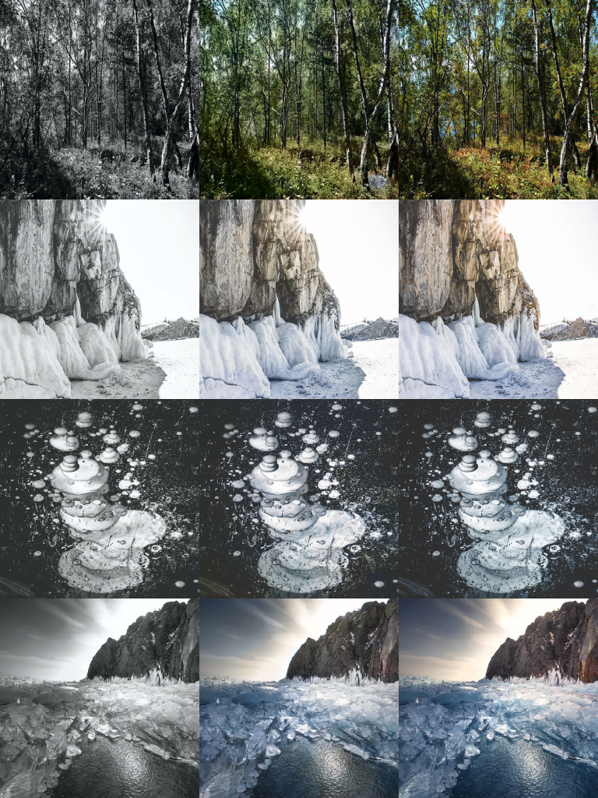

# pix2pix

This is a slight modification of [Keras implementation](https://github.com/tdeboissiere/DeepLearningImplementations) of [Image-to-Image Translation with Conditional Adversarial Networks](https://arxiv.org/pdf/1611.07004) by Phillip Isola, Jun-Yan Zhu, Tinghui Zhou, Alexei A. Efros. We modify our discriminator according to [Wasserstein GAN](https://arxiv.org/abs/1701.07875) and train it only for grayscale->color objective using [http://floydhub.com](http://floydhub.com) services.

# Requirements

## python modules

- keras 2.0, tensorflow 1.1.0 backend
- h5py
- matplotlib
- opencv 3
- numpy
- tqdm
- parmap
- graphviz

# Part 1. Processing the data

Follow [these instructions]https://github.com/fineguy/Adversarial-Image-Colorization/tree/master/src/data).

# Part 2. Running the code

Follow [these instructions](https://github.com/fineguy/Adversarial-Image-Colorization/tree/master/src/model)

# Part 3. Example results

For each image:

- The first column is the generator input
- The second column is the generator output
- The last column is the original image 
